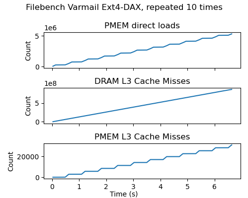

# PMicroProfile

PMicroProfile is a performance profiling framework that can be used to evaluate the performance of Persistent Memory (PMEM) file systems, such as Ext4-DAX and SplitFS. The unique approach of this framework is that it captures low-level PMEM access traces, and replays those traces to identify performance bottlenecks between CPU and PMEM.

Currently, PMicroProfile only supports Intel Optane DC Persistent Memory.

## Design

.

PMicroProfile consists of two tools that complement each other:

- _pmemtrace_: a tool that captures file system access patterns in the form of machine instructions (e.g. `movnti`)
- _pmemanalyze_: a tool that replays caputured traces and calculates performance metrics (see example below)




## Installation

The installation instructions for both _pmemtrace_ and _pmemanalyze_ tools are provided below.

### _pmemtrace_

The installation process consists of two steps: establishing a QEMU virtual machine instance with a custom kernel and afterward installing the _pmemtrace_ tracing tool.
Most of the steps involve running automated scripts that pre-configure all required dependencies and infrastructure in such a way that it requires minimal effort.
First, set up a new QEMU VM instance:

```bash
$ git clone https://github.com/wvanbreukelen/PMicroProfile
$ cd PMicroProfile

# Run the automated install script.
$ ./setup-vm.sh
```

You may now proceed to the Ubuntu installation wizard by executing the \path{vm/run_kvm_iso.sh} script. After finishing the Ubuntu installation, perform the following steps:


1. Remove the installation medium by commenting/removing the line `-cdrom "ubuntu.iso"` in _vm/run_kvm_iso.sh_;
2. Open a terminal inside the VM and execute the following command: `$ cat /proc/mounts | grep " / "`;
3. Copy the mount path of the root file system, for example, _/dev/sda5_, and update the kernel _root_ boot parameter in the _vm/run_kvm.sh_ file accordingly;
4. _Optional_: Modify the number of cores, the amount of RAM, and the size of the emulated PMEM device by modifying the _vm/run_kvm.sh_ file accordingly;
5. Now, boot the VM using the custom kernel by executing the script `vm/run_kvm.sh`;
6. Verify that you are running the custom kernel by running `uname -r` within the VM. This command should print `5.4.232`.

Within the VM, spawn a terminal and, again, clone the git repository. Subsequently, run the _pmemtrace_ installation script:

```bash
$ git clone https://github.com/wvanbreukelen/PMicroProfile
$ cd PMicroProfile

# Run the automated pmemtrace install script.
$ ./install-vm.sh
```

The `pmemtrace` executable will be placed inside the _/usr/local/bin/_ folder so that it is contained in the user `$PATH`. Verify this by running `sudo pmemtrace --help`.


### _pmemanalyze_

WIP

## Usage


WIP